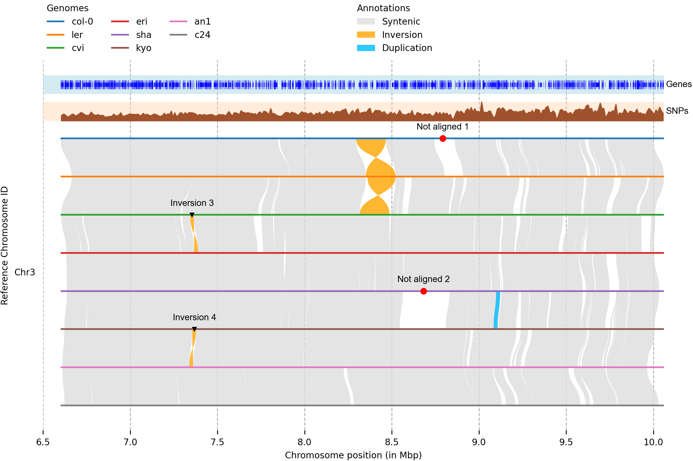

## [Help us in upgrading syri](https://github.com/schneebergerlab/syri/discussions/230)

## Introduction:

Syri compares alignments between two chromosome-level assemblies and identifies synteny and structural rearrangements.


<i> Figure generated using [plotsr](https://github.com/schneebergerlab/plotsr) </i>

## Pre-requisite:

1. Python >=3.8 and the following packages: Cython-0.29.23, numpy-1.21.2, scipy-1.6.2, pandas-1.2.4, python-igraph-0.9.1, psutil-5.8.0, pysam-0.16.0.1, and matplotlib-3.3.4
2. C/C++ compiler: g++

## Recent major updates:
(20-06-2022)
* Added printing of large indels and HDR.
* Added parameter `--maxsize` to regulate the maximum size of SV for which sequence would be printed.
* Added parameter `--hdrseq` to toggle printing of HDR sequences.


(10-05-2022)
* SyRI v1.6 is now available.
* Added `--invgaplen` parameter to regulate the gap length between alignments of an inversion. This can also be used to filter out inversions with very different sizes between the reference and query genomes
* Added reader for PAF files and can be used using `-F P`

## Installation:

Easiest way to install SyRI is through anaconda:

```
# Create a new environment and install syri with all dependencies
conda create -n syri_env -c bioconda syri
# Activate the environment
conda activate syri_env
```

2
For manual installation, download/clone the repository, open the folder and run:
`python setup.py install`

## Running:

After installation, SyRI would be in your path and can be run directly from command line. Test the installation using:

```
syri -h
```

Detailed information is available at: https://schneebergerlab.github.io/syri

## Citation:

Please cite:

`Goel, M., Sun, H., Jiao, W. et al. SyRI: finding genomic rearrangements and local sequence differences from whole-genome assemblies. Genome Biol 20, 277 (2019) doi:10.1186/s13059-019-1911-0`

## Current Limitations:

1. The homologous chromosomes in the two genomes need to represent the same strand. If the chromosomes are from different strands, then the alignments between these chromosomes would be inverted. As SyRI only checks directed alignments for syntenic region identification, it would not be able to find syntenic regions and can crash.
   Current solution to this problem is to manually check alignments. If the majority of alignments between homologous chromosomes are inverted, then the chromosome in the query genome needs to be reverse-complemented. Then the corrected query genome needs to be aligned against the reference genome. We are working on a method which can generate dot plots to automatically identify and reverse-complement such inverted-chromosomes.
2. Large translocations and duplications (consisting of multiple alignments) can result in high memory-usage and CPU runtime.

## Older Updates:

(10-03-2022)

* SyRI is now available on anaconda and can be installed using:

```
conda install -c bioconda syri
```

(17-01-2022)

* Making the python >3.8 version as the default (master) branch. For using older version, use the following command:

```
git clone --single-branch --branch V1.4.1 https://github.com/schneebergerlab/syri.git
```

* [Plotsr](https://github.com/schneebergerlab/plotsr) is now a separate package. It can be installed using anaconda:

```
conda install -c bioconda plotsr
```

* Removed biopython as a dependency. Now uses inbuild function to read fasta files.

(12-10-2021)

* Issues in inversion detection: The recent releases of minimap2 (2.18-2.22) have some bug which results in inverted regions not getting aligned correctly. This issue is mostly fixed in the current master branch (HEAD node) of minimap2 repository. So, for accurate structural rearrangement identification with SyRI please use the latest version of minimap2.

(13-06-2021)

* SyRI V1.5 is now available. With this update, SyRI is now compatible with python3.8. You can download it using:
  `git clone --single-branch --branch V5  https://github.com/schneebergerlab/syri.git`
* SyRI v1.4 (current major version for python3.5) will not be developed anymore (except for bug fixes) and all new features will be added in SyRI V1.5 onwards.
* Currently, master branch still corresponds to SyRI V1.4, however, this will change after SyRI V1.5 is released.

(14-05-2020)

* Added a new method `plotsr` in `./syri/bin/` for plotting genomic structures (syntenic and structurally rearranged regions)
* Optimised inversion identification improving worst-case performance by many folds.
