# Alignment benchmark 2024
#### _- Seungmin Park, Manish Goel_


### Table of contents

1. [Introduction](#introduction)
2. [Methods](#methods)
    1. [Genomes](#genomes)
    2. [Genome/assembly alignment](#genomeassembly-alignment)
        1. [Minimap2](#minimap2)
        2. [Winnowmap](#winnowmap)
        3. [AnchorWave](#anchorwave)
        4. [NUCmer](#nucmer)
    3. [SyRI](#syri)
3. [Results](#results)
    1. [Alignment statistics](#alignment-statistics)
    2. [Structural rearrangements & sequence variations](#structural-rearrangements--sequence-variations)
4. [Observations summary](#observations-summary)
5. [Additional materials](#additional-materials)

# Introduction

SyRI uses alignments between two chromosome-level assemblies and identifies syntenic blocks, sequence variations and structural rearrangements. Since the release of SyRI in 2019, new whole-genome assembly aligners have been developed while the old aligners have been updated. Here, we analyse the performance of SyRI when using alignments generated using these the currently avaialble state-of-the-art aligners. Analysing genomes of different species with multiple parameter settings for the aligners, these benchmarks provide a quick overview of the expected syri output while also serving as guide for setting up comparative genomics pipeline for other species.
<div style="page-break-after: always;"></div>

# Methods
<p align='center'>
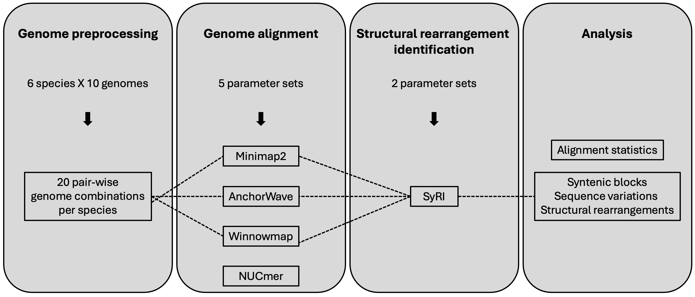
<br />
<em>Overview of the workflow</em>
</p>

## Genomes

We selected ten chromosome-level assemblies for six species with different genomic complexities.

- *S. cerevisiae*
- *D. melanogaster*
- *A. thaliana*
- *S. tuberosum*
- *B. taurus*
- *H. sapiens*

Full list of genomes used: [Genome list](#genome-list)

For each species, **twenty pair-wise genome combinations** were then used for alignment.

### *Preprocessing of the genomes*

For each genome, FASTA file was filtered to select autosomal chromosome sequences.

In addition, all homologous chromosome sequence orientations were corrected in respect to a selected genome from each species using [fixchr](https://github.com/schneebergerlab/fixchr) package.

## Genome/assembly alignment

**We tried using four whole-genome alignment tools** to align the genome combinations.
- [Minimap2](thtps://github.com/lh3/Minimap2) v2.28-r1209
- [Winnowmap](https://github.com/marbl/Winnowmap) v2.03
- [AnchorWave](https://github.com/baoxingsong/AnchorWave) v1.2.5
- [AnchorWave](https://github.com/mummer4/mummer) v4.0.1

For each alignment tool, **5 different parameter settings** were selected to test variation in alignments and its effect in structural variation identification.

List of parameter settings used for each alignment tool: [Parameter settings](#parameter-settings)

### *Minimap2*

In addition to the 3 presets corresponding for the use of sequence divergence of 5/10/20%, the changes in the parameter for chaining/alignment bandwidth and long-join bandwidth were tested.

### *Winnowmap*

Winnowmap requires pre-computation of high frequency k-mers in the selected reference genomes. [Meryl](https://github.com/marbl/meryl) was used for k-mer counting. The top 0.02% most frequent k-mers were filtered out.

```
# Count high frequency k-mers
meryl count k=19 output merylDB asm1.fa
# Filter for the top 0.02% most frequent k-mers
meryl print greater-than distinct=0.9998 merylDB > repetitive_k19.txt
```

As Winnowmap was developed on top of Minimap2 codebase, parameter set tested for Minimap2 were also tested for Winnowmap.

### *AnchorWave*

AnchorWave generates whole-genome alignment using collinear blocks. These blocks are identified via conserved anchors corresponding to full-length CDS and exon.

As AnchorWave utilizes CDS GFF3 to identify the anchors, we standardized the GFF  files for the conventional reference genomes from each species into a comprehensive GFF3 format using
[AGAT](https://github.com/NBISweden/AGAT).

```
agat_convert_sp_gxf2gxf.pl -g infile.gff
```

Prior to the alignment, the identification of anchors requires 2 steps.

- Extraction of full-length CDS from the reference genome sequence and gene annotation in GFF3 format as input.

- Lift over of the start and end positions of reference full-length CDS to the query genome.

```
# Extract full-length CDS
AnchorWave gff2seq -r ref.fa -i ref.gff -o cds.fa
# Lift over to reference and query genome
Minimap2 -x splice -t 10 -k 12 -a -p 0.4 -N 20 (ref.fa/query.fa) cds.fa > (ref.sam/query.sam)
```

Since, AnchorWave requires high-quality GFFs, for each species **nine pair-wise genome combinations were tested** where the nine non-reference species were compared against the reference genome.

Alignments were performed using the **proali** function, designed for genome alignments involving relocation variations, chromosome fusion, or whole-genome duplication. Alongside the default settings, parameter adjustments for sequence alignment window width and inter-anchor length threshold (for finding new anchors) were tested.

To identify structural rearrangements, the fragmented MAF output was converted to SAM/BAM format. The [maf-convert](https://gitlab.com/mcfrith/last/-/blob/main/bin/maf-convert) script was used for this conversion, with the option to include dictionary of sequence lengths, in order to comply with the format required in the downstream SyRI usage.

```
python maf-convert.py sam AnchorWave.maf -d > AnchorWave.sam
```

Alignments were filtered to retain only those with at least one matched base in the CIGAR string and appropriate start and end positions. Furthermore, to account for the rare cases in which the inverse alignments' start and stop positions are identical, the BAM files were also filtered to remove these alignments.

### *NUCmer*

NUCmer is an executable within [MUMmer](https://github.com/mummer4/mummer), an alignment tool for DNA and protein sequences. NUCmer is used for the all-vs-all comparison of nucleotide sequences, best used for highly similar sequence that may have large rearrangements.

In addition to the default settings and those from the original SyRI paper, parameter adjustments for minimum cluster length, alignment extension distance, and minimum maximal exact match length were tested.

Two major issues with NUCmer prevented its results from being included in this report:

1. Unexplainable crashes while running NUCmer 4
2. Run time issue in NUCmer 3 because of:
    1. no parallel processing 
    2. Failure to align when using `--maxmatch` with assemblies containing centromeric sequence.

Due to these limitations, results from NUCmer could not be included.

## SyRI

By default, SyRI filters out low quality and small alignments. Here, we tested syri with the default filtering and with the full list of alignments (without any filtering).

```
# SyRI with filter option (default)
syri -c input.bam -r ref.fa -q query.fa -F B
# SyRI without filter option
syri -c input.bam -r ref.fa -q query.fa -F B -f
```

## Results

### Alignment statistics

Overall, AnchorWave produces significantly more alignments than the other two aligners. However, the fraction of the reference/query genomes mapped differs to a lesser degree, suggesting that Minimap2 and Winnowmap generate fewer alignments while covering a larger portion of the genomes.

Higher sequence divergence parameters (parameters 2 & 3) for Minimap2 and Winnowmap had the greatest impact on plant genomes, resulting in fewer alignments and a higher fraction of the reference/query genomes mapped. The parameter set 4 of AnchorWave lowers the inter-anchor length threshold resulting in  fewer alignments compared to the other parameters, particularly in mammalian genomes, where the number of alignments becomes similar to that of Minimap2/Winnowmap.

<div style="page-break-after: always;"></div>

**Number of alignments and bases mapped**
<p align='center'>
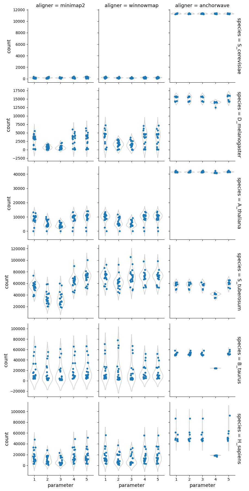
<br />
<em>Number of alignments</em>
</p>
<div class="page"/>

<p align='center'>
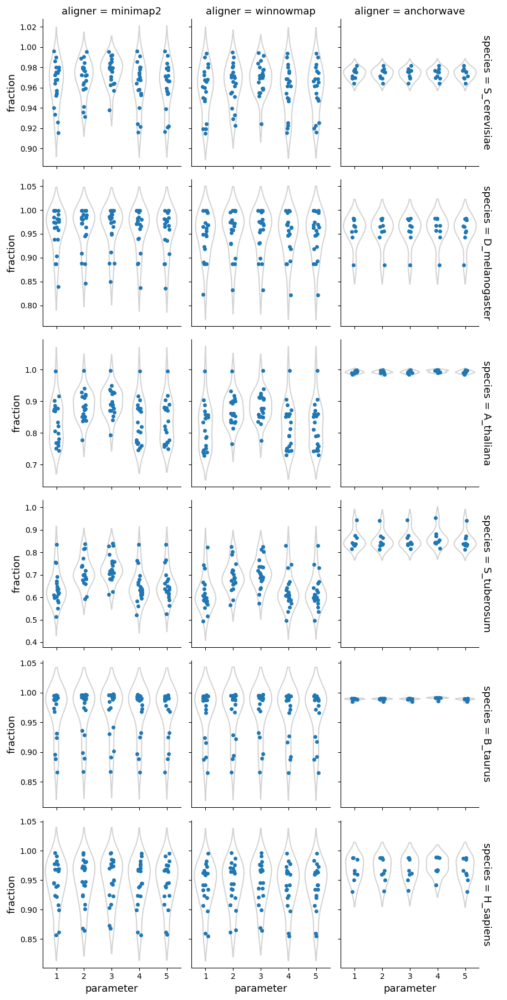
<br />
<em>Fraction of the reference genome mapped</em>
</p>
<div class="page"/>

<p align='center'>
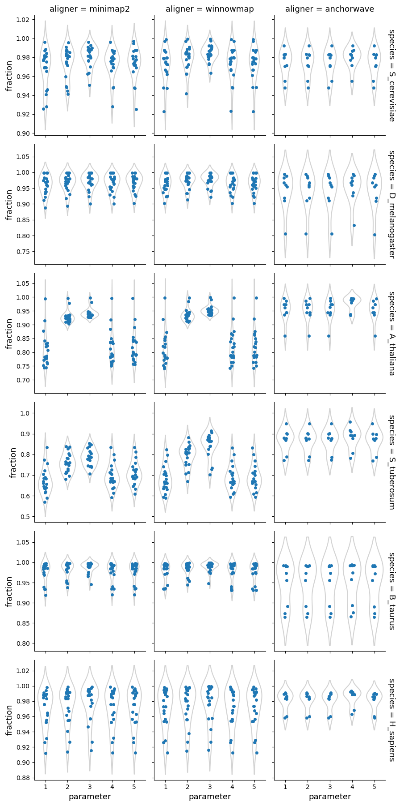
<br />
<em>Fraction of the query genome mapped</em>
</p> 
<div class="page"/>


<div style="page-break-after: always;"></div>

### Structural rearrangements & sequence variations

**Syntenic regions**

Syri reports syntenic blocks defined as colliear syntenic alignments uninterrupted by rearrangements. That means that the number of reported unique syntenic blocks is dependent on the number of identified strucutral rearrangements. 

For highly similar genomes (such as from the same ecotype, isolate, breed, or cultivar), syntenic blocks had fewer breaks. This illustrates that similar genomes have fewer rearrangements resulting in few longer syntenic blocks.

In general, syri run with alignments generated by Winnowmap reported more fragmented syntenic blocks compared to Minimap2, suggesting higher propensity to find structural rearrangements with Winnowmap alignments. The number and proportion of syntenic regions were also affected by the default filtering of syri. While winnowmap and minimap2 produced similar results, the syntenic regions from alignments generated with Anchorwave were quite different. Possibly, because Anchorwave identifed collinear alignments which limited the detection power of structural rearrangements. 

Syri's output is also dependent on the quality of genome assembly. In our dataset, one human genome assembly was of lower quality (had 10-times more scaffolds) compared to the others. Such assemblies can result in fragmentation of identifiable synteny leading to a larger number of syntenic regions (twice for one example with winnowmap) compared to the overall population.

<p align='center'>

<br />
<em>Number of syntenic regions</em>
</p> 
<div class="page"/>

<p align='center'>

<br />
<em>Fraction of reference genome corresponding to the syntenic regions</em>
</p> 
<div class="page"/>

<p align='center'>

<br />
<em>Fraction of query genome corresponding to the syntenic regions</em>
</p> 
<div class="page"/>


<div style="page-break-after: always;"></div>

**Structural rearrangements**

Higher sequence divergence parameters (parameters 2 & 3) in Minimap2 and Winnowmap identified more structural rearrangements (cumulative count of inversions, duplications, and translocations identified by SyRI). This effect is more pronounced in Winnowmap, where most structural rearrangements correspond to duplications.

<p align='center'>

<br />
<em>Number of structural rearrangements</em>
</p> 
<div class="page"/>

<p align='center'>

<br />
<em>Fraction of reference genome corresponding to the structural rearrangements</em>
</p> 
<div class="page"/>

<p align='center'>

<br />
<em>Fraction of query genome corresponding to the structural rearrangements</em>
</p> 
<div class="page"/>

<div style="page-break-after: always;"></div>

**Not aligned regions**

Diverging genomic region keep accumulating mutations. Over time, this divergence could become so large that the whole-genome aligners cannot align these originally same sequences with high confidence, thus resulting in not aligning regions. However, it is also possible that a sequence get replaced by another sequence resulting in co-located but not aligning regions in the genomes. Distinguishing between the two is not trivial.

By default, SyRI filters out small and low quality alignments. This can lead to a higher proportion of not aligned regions compared to when no alignments get filtered out. This effect is stronger in species where different strains are more diverged to each other (eg: _S. tuberosum_).

In some species, differences in the normalized length of reference/query unaligned regions are observed for AnchorWave. These differences may result from the presence of regions in one genome that are absent in the other genome (e.g., centromeric regions) or from variations in genome assembly quality.

<p align='center'>

<br />
<em>Fraction of reference genome corresponding to the not aligned regions</em>
</p> 
<div class="page"/>

<p align='center'>

<br />
<em>Fraction of query genome corresponding to the not aligned regions</em>
</p> 
<div class="page"/>


<div style="page-break-after: always;"></div>


# Observations

* In general, Minimap2 and Winnowmap showed similar alignment statistics to AnchorWave. However, Minimap2 and Winnowmap generated fewer alignments that covered more reference/query genome sequences. Additionally, the alignments from these two aligners exhibited more variation across different parameters when aligning plant genomes. 

* The use of higher sequence divergence parameters in Minimap2 and Winnowmap, resulted in more alignments with lower identities. Consequently, syri identified more structural rearrangements identified, specifically duplications.

* AnchorWave produced MAF output with a large number of alignments, many of which were filtered out when SyRI’s filtering parameter was applied. This suggests that many of the alignments were small and of low quality.

* A lower inter-anchor length threshold in AnchorWave, below which new anchor search is stopped (parameter 4), reduces the number of alignments while increasing alignment size and identity in mammalian genomes. This observation runs in parallel with the similar number of syntenic and highly diverged regions between the non-filtered and filtered sets.
<div style="page-break-after: always;"></div>

## Additional materials

### Genome list

All genomic FASTA and GFF files were retrieved from the NCBI database.

<style>
  table {font-size: 12px;}
</style>

| Species | Assembly | Accession number |
| ------- | -------- | ---------------- |
| *S. cerevisiae* | R64 | GCF_000146045.2 |
|| ASM4093860v1 | GCA_040938605.1 |
|| ASM3086668v1 | GCA_030866685.1 |
|| ASM3029217v1 | GCA_030292175.1 |
|| ScYPH499_1.0 | GCA_026000965.1 |
|| ScPE_H3_f | GCA_905220325.1 |
|| Sc_YJM1078_v1 | GCA_000975645.3 |
|| ASM2350882v1 | GCA_023508825.1 |
|| ASM29281v1 | GCA_000292815.1 |
|| Sc_YJM1250_v1 | GCA_000976935.2 |
| *D. melanogaster* | Release 6 plus ISO1 MT | GCF_000001215.4 |
|| ASM2977509v1 | GCA_029775095.1 |
|| ASM231075v1 | GCA_002310755.1 |
|| ASM4260644v1 | GCA_042606445.1 |
|| RU_dmel_BG3_1.0 | GCA_034768405.1 |
|| DGRP379 | GCA_004798055.1 |
|| ASM1583244v1 | GCA_015832445.1 |
|| ASM2014167v1 | GCA_020141675.1 |
|| ASM1585258v1 | GCA_015852585.1 |
|| UCI_ORw1118_1.0 | GCA_024500395.1 |
| *A. thaliana* | TAIR10.1 | GCF_000001735.4 |
|| Col-CC | GCA_028009825.2 |
|| Ler-0.7213 | GCA_946406525.1 |
|| Cvi-0.6911 | GCA_946414125.1 |
|| Tanz-1.10024 | GCA_946409825.1 |
|| Rabacal-1.22005 | GCA_946406895.1 |
|| IP-Mos-9 | GCA_946411805.1 |
|| IP-Hom-0 | GCA_946411425.1 |
|| MERE-A-13 | GCA_946411655.1 |
|| IP-Sln-22 | GCA_946413935.1 |
| *S. tuberosum* | solTubStieglitzHap1 | GCA_020169555.1 |
|| ASM1507626v1	| GCA_015076265.1 |
|| ASM1418947v1	| GCA_014189475.1 |
|| ASM982717v1	| GCA_009827175.1 |
|| ASM982715v1	| GCA_009827155.1 |
|| solTubHeraHap2 | GCA_020169575.1 |
|| solTubHeraHap1	| GCA_020169585.1 |
|| ASM1418930v1	| GCA_014189305.1 |
|| ASM1418299v2	| GCA_014182995.2 |
|| ASM1418298v2	| GCA_014182985.2 |
| *B. taurus* | ARS-UCD2.0 | GCF_002263795.3 |
|| UOA_Wagyu_1	| GCA_040286185.1 |
|| UOA_Tuli_1	| GCA_040285425.1 |
|| NRF	| GCA_963921495.1 |
|| SNU_Hanwoo_2.0	| GCA_028973685.2 |
|| ARS-LIC_NZ_Jersey	| CA_021234555.1 |
|| ASM3988117v1	| GCA_039881175.1 |
|| ASM4388211v1	| GCA_043882115.1 |
|| ROSLIN_BTT_NDA1	| GCA_905123515.1 |
|| ARS-LIC_NZ_Holstein-Friesian_1	| GCA_021347905.1 |
| *H. sapiens* | T2T-CHM13v2.0 | GCF_009914755.1 |
|| GRCh38.p14	| GCF_000001405.40 |
|| hg002v1.1.mat	| GCA_018852615.3 |
|| hg01243.v3.0	| GCA_018873775.2 |
|| Han1	| GCA_024586135.1 |
|| hg002v1.1.pat	| GCA_018852605.3 |
|| HS1011_v1.1	| GCA_001292825.2 |
|| KOREF1.0	| GCA_001712695.1 |
|| ASM1490585v1	| GCA_014905855.1 |
|| PGP1v1	| GCA_020497115.1 |


### Parameter settings

| Aligner | Parameter | Description |
| ------- | --------- | ----------- |
| Minimap2 | minimap2 -ax asm5 --eqx <ref.fa> <asm.fa> > <aln.sam> | 5% sequence divergence |
|| minimap2 -ax asm10 --eqx <ref.fa> <asm.fa> > <aln.sam> | 10% sequence divergence |
|| minimap2 -ax asm20 --eqx <ref.fa> <asm.fa> > <aln.sam> | 20% sequence divergence |
|| minimap2 -ax asm5 --eqx -r1k,20k <ref.fa> <asm.fa> > <aln.sam> | Larger bandwidth for initial chaining and alignment extension |
|| minimap2 -ax asm5 --eqx  -r500,10k <ref.fa> <asm.fa> > <aln.sam> | Smaller bandwith for RMQ-based re-chaining and closing gaps |
| Winnowmap | winnowmap -W repetitive_k19.txt -ax asm5 --eqx asm1.fa asm2.fa > output.sam | 5% sequence divergence |
|| winnowmap -W repetitive_k19.txt -ax asm10 --eqx asm1.fa asm2.fa > output.sam | 10% sequence divergence |
|| winnowmap -W repetitive_k19.txt -ax asm20 --eqx asm1.fa asm2.fa > output.sam | 20% sequence divergence |
|| winnowmap -W repetitive_k19.txt  -a -k19 -w19 -r500,20k -g10k -A1 -B19 -O39,81 -E3,1 -s200 -z200 --eqx asm1.fa asm2.fa > output.sam | Larger bandwidth for initial chaining and alignment extension |
|| winnowmap -W repetitive_k19.txt  -a -k19 -w19 --r300,10k  -g10k -A1 -B19 -O39,81 -E3,1 -s200 -z200 --eqx asm1.fa asm2.fa > output.sam | Smaller bandwith for initial chaining, alignment extension, RMQ-based re-chaining and closing gaps |
| AnchorWave | anchorwave proali -i <refGffFile> -r <refGenome> -a <cds.sam> -as <cds.fa> -ar <ref.sam> -s <targetGenome> -n <outputAnchorFile> -o <output.maf> -f <output.fragmentation.maf> -R 1 -Q 1 | Default parameter |
|| anchorwave proali -i <refGffFile> -r <refGenome> -a <cds.sam> -as <cds.fa> -ar <ref.sam> -s <targetGenome> -n <outputAnchorFile> -o <output.maf> -f <output.fragmentation.maf> -R 1 -Q 1 -w 50000 | Smaller sequence alignment window width |
|| anchorwave proali -i <refGffFile> -r <refGenome> -a <cds.sam> -as <cds.fa> -ar <ref.sam> -s <targetGenome> -n <outputAnchorFile> -o <output.maf> -f <output.fragmentation.maf> -R 1 -Q 1 -w 150000 | Larger sequence alignment window width |
|| anchorwave proali -i <refGffFile> -r <refGenome> -a <cds.sam> -as <cds.fa> -ar <ref.sam> -s <targetGenome> -n <outputAnchorFile> -o <output.maf> -f <output.fragmentation.maf> -R 1 -Q 1 -fa3 50000 | Lower inter-anchor length threshold below which the search for new anchors is stopped |
|| anchorwave proali -i <refGffFile> -r <refGenome> -a <cds.sam> -as <cds.fa> -ar <ref.sam> -s <targetGenome> -n <outputAnchorFile> -o <output.maf> -f <output.fragmentation.maf> -R 1 -Q 1 -fa3 150000 | Higher inter-anchor length threshold below which the search for new anchors is stopped |
| NUCmer | nucmer --maxmatch  -c 100 -b 500 -l 50 -g 90 <ref.fa> <qry.fa> | Parameters used in the SyRI paper |
|| nucmer --maxmatch -c 100 -b 200 -l 20 -g 90 <ref.fa> <qry.fa> | Default parameters |
|| nucmer --maxmatch -c 100 -b 1000 -l 50 -g90 <ref.fa> <qry.fa> | Default minimum cluster length |
|| nucmer --maxmatch -c 100 -b 500 -l 100 -g 90 <ref.fa> <qry.fa> | Default distance for alignment extension |
|| nucmer --maxmatch -c 100 -b 500 -l 50 -g 150 <ref.fa> <qry.fa> | Default minimum length of maximal exact match |
<div style="page-break-after: always;"></div>

### Supplementary figures


**Alignment sizes and identities**

<p align='center'>
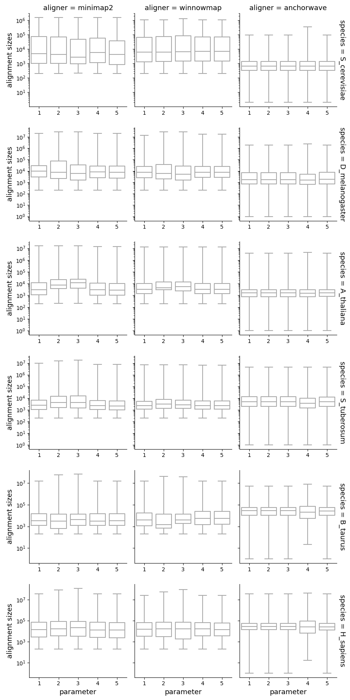
<br />
<em>Alignment sizes</em>
</p> 
<div class="page"/>

<p align='center'>
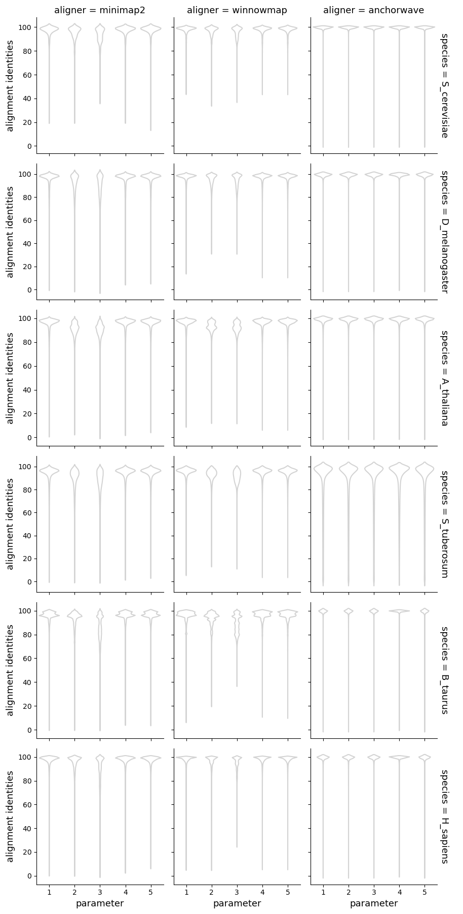
<br />
<em>Alignment identities</em>
</p> 
<div class="page"/>

<div style="page-break-after: always;"></div>


**Forward alignments**
<p align='center'>
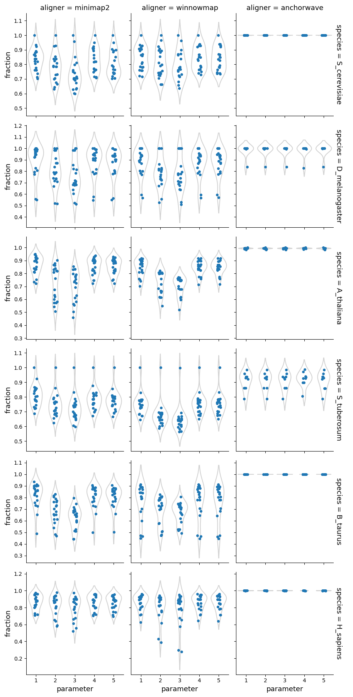 
<br />
<em>Fraction of the forward alignments</em>
</p> 
<div class="page"/>

**Inversions**
<p align='center'>
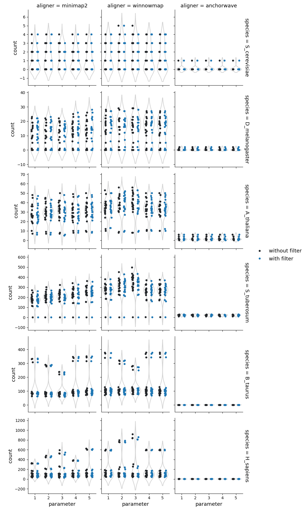
<br />
<em>Number of inversions</em>
</p> 
<div class="page"/>

<p align='center'>
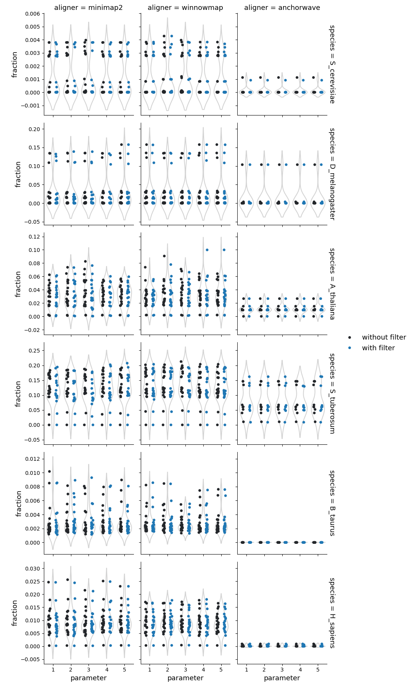
<br />
<em>Fraction of reference genome corresponding to the inversions</em>
</p> <div class="page"/>

<p align='center'>
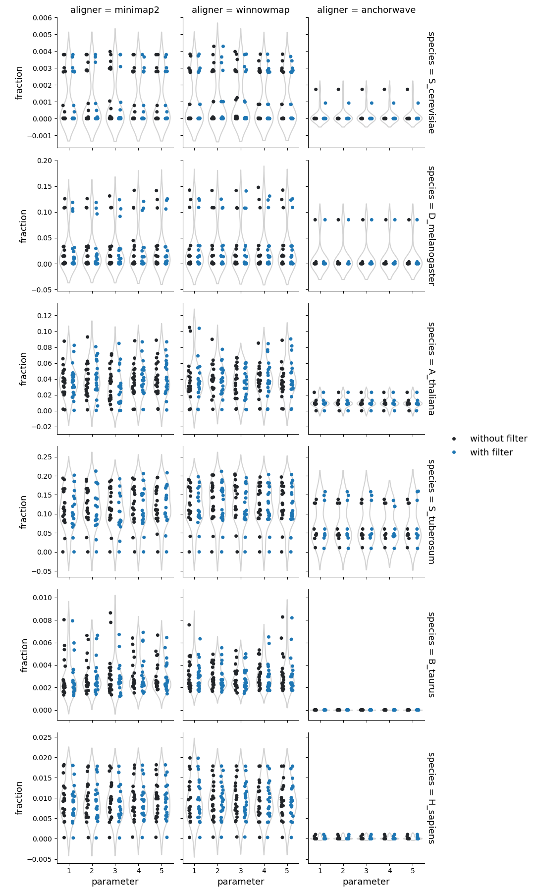
<br />
<em>Fraction of query genome corresponding to the inversions</em>
</p> 
<div class="page"/>

**SNPs**
<p align='center'>
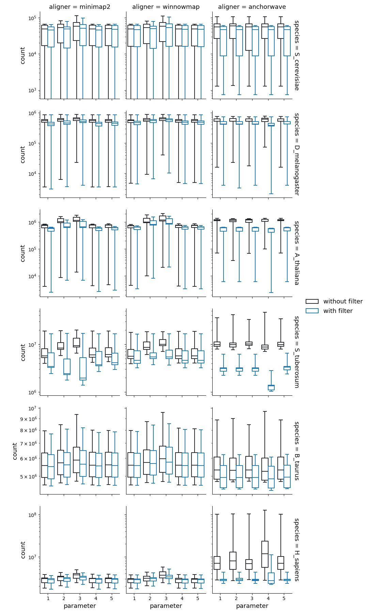
<br />
<em>Number of SNPs</em>
</p> 
<div class="page"/>

**Insertions and Deletions**

<p align='center'>
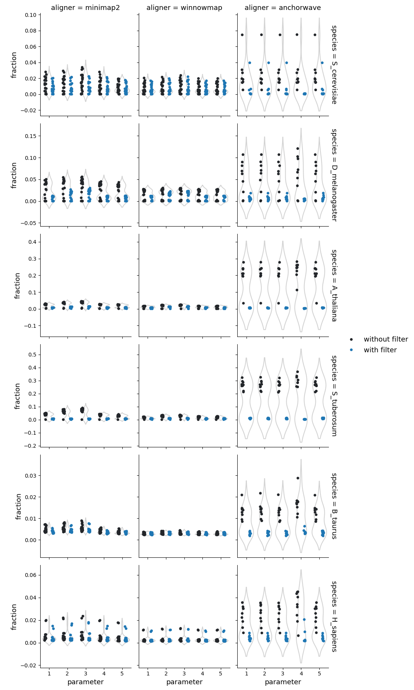
<br />
<em>Fraction of query genome corresponding to the insertions</em>
</p> 
<div class="page"/>

<p align='center'>
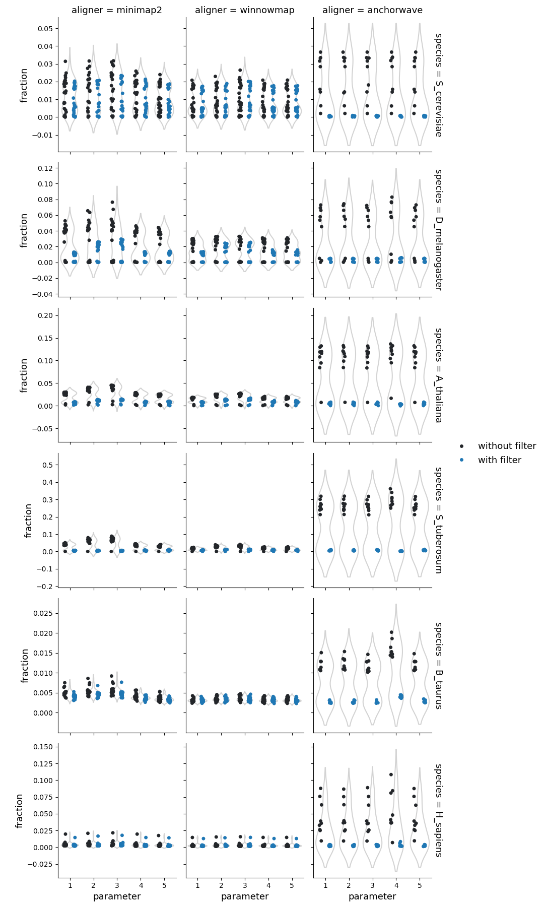
<br />
<em>Fraction of reference genome corresponding to the deletions</em>
</p> 
<div class="page"/>


**Copy gains and Copy losses**
<p align='center'>
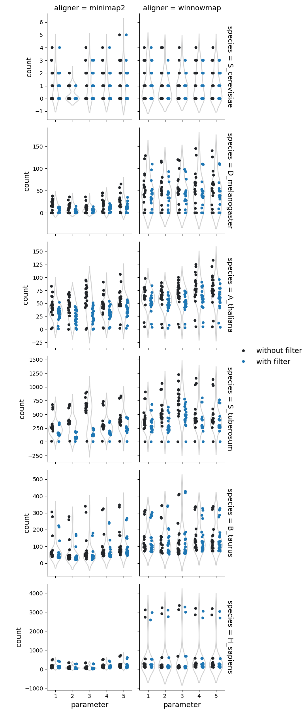
<br />
<em>Number of copy gains</em>
</p> 
<div class="page"/>

<p align='center'>
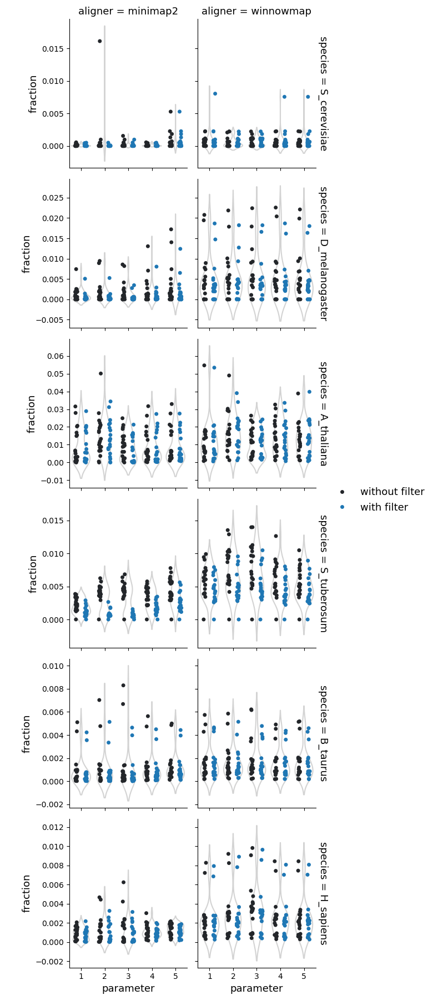
<br />
<em>Fraction of query genome corresponding to the copy gains</em>
</p> 
<div class="page"/>

<p align='center'>
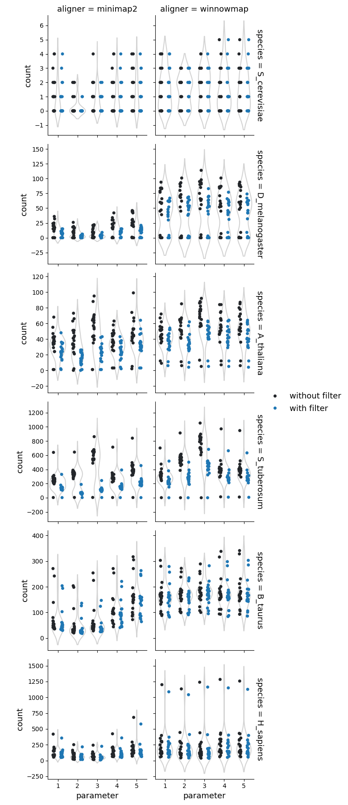
<br />
<em>Number of copy losses</em>
</p> 
<div class="page"/>

<p align='center'>
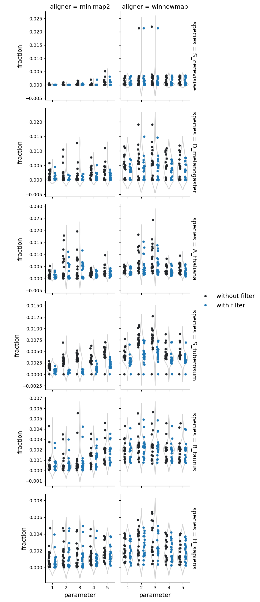
<br />
<em>Fraction of reference genome corresponding to the copy losses</em>
</p> 
<div class="page"/>

**Highly diverged**
<p align='center'>

<br />
<em>Number of highly diverged regions</em>
</p> 
<div class="page"/>

<p align='center'>

<br />
<em>Fraction of reference genome corresponding to the highly diverged regions</em>
</p> 
<div class="page"/>

<p align='center'>

<br />
<em>Fraction of query genome corresponding to the highly diverged regions</em>
</p> 
<div class="page"/>

**Tandem repeats**
<p align='center'>

<br />
<em>Number of the tandem repeats</em>
</p> 
<div class="page"/>

<p align='center'>

<br />
<em>Fraction of reference genome corresponding to the tandem repeats</em>
</p> 
<div class="page"/>

<p align='center'>

<br />
<em>Fraction of query genome corresponding to the tandem repeats</em>
</p> 
<div class="page"/>
