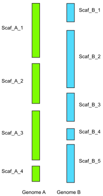

### Pseudo-genome assembly generation using `chroder`
Biologically, syntenic regions are meaningful only for homologous regions. Consequently, to find structural rearrangements (which depend on identification of syntenic regions), it is necessary that the DNA molecules in the two genomes are homologous to each other and it is possible to have a one-to-one mapping between molecules of the two assemblies. Typically, this would require the assemblies to be at chromosome-level. In cases when one or both assemblies are not at chromosome-level, pseudo-chromosomes can be generated using homology between the two genome assemblies. The `chroder` utility can be used in such cases to generate pseudo-choromosomes. It can generate pseudo-genomes using the homology of an incomplete genome with the reference (chromosome-level assembled) genome as well as using the homology between two incomple assemblies. Thus species for which no chromosome-level assemblies are available can also be analysed.

`chroder` analyses the whole-genome alignment between two incomplete genome assemblies. When one of the assemblies is at chromosome-level, then the scaffolds from the other assemblies are anchored with respect to the chromosomes. Order of the scaffolds is determined based on the location where it aligns in the chromosome. Similarly, scaffold orientation in the pseudo-chromosome depends on the alignment direction (whether the scaffold align to the sense or the anti-sense sequence) with the chromosome. Scaffolds having inverted alignments are reverse-complemented, as a result all scaffolds are in forward orientation with respect to the chromosomes.

When both assemblies are at scaffold-level, `chroder` groups scaffolds (from one assembly) which align to same scaffold in the other assembly. This creates a chain of scaffolds which potentially originated from neighbouring regions of a chromosome. The scaffolds are then ordered and oriented and then concatenated with Ns to create pseudo-chromosome like molecule.

<p align='center'>

<br />
<em>Scaffolds from Genome A (green) are aligned against scaffolds from Genome B (blue). Scaffolds aligning to same scaffold are grouped together. For example, Scaf_B_1 and Scaf_B_2 both align to Scaf_A_1 and therefore could be considered to have been originated from neighboring regions in the original chromosome. Similarly, Scaf_A_1 and Scaf_A_2 could be considered as to have been originated from neighboring region. This process is repeated to find all scaffolds which could have originated from same chromosome, which are then concatenated to generate pseudo-chromosome like molecule.</em>
</p>

```
usage: chroder [-h] [-n NCOUNT] [-o OUT] [-noref] coords ref qry

positional arguments:
  coords      Alignment coordinates in a tsv format
  ref         Assembly of genome A in multi-fasta format
  qry         Assembly of genome B in multi-fasta format

optional arguments:
  -h, --help  show this help message and exit
  -n NCOUNT   number of N's to be inserted
  -o OUT      output file prefix
  -noref      Use this parameter when no assembly is at chromosome level
```

This method is highly heuristic and should not be considered as an alternative to a dedicated scaffolding program. Further, generating homology based pseudo-chromosome will result in higher false negatives as some of the structural rearrangements between assemblies will be removed during pseudo-chromosome generation.
