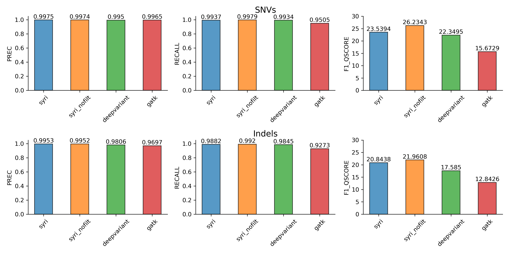
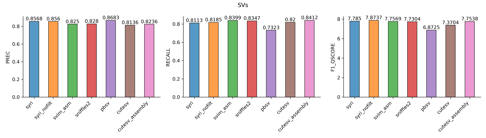

# Variant calling benchmarking (2024)

# Introduction
Syri was first benchmarked in 2019. Since then, it has received multiple updates and improvements. Similarly, other variant callers have improved as well along with the introduction of new variant callers. Here, we benchmark the variant (both small and SVs) calling performance of syri against some of the most popular variant callers. This should provide users an estimate of the expected performance.

# Benchmarking Results
Genomic variation can be grouped as small variations (SNPs and short indels), structural variations (large indels, tandem duplications) and structural rearrangements (inversions, translocations, segmental duplications). Here, we limit the benchmarking to the identification of small variants and SVs (large indels) as benchmark VCFs for structural rearrangements are lacking.

### Small variation
We compared syri, deepvariant, and gatk. Both syri and deepvariant performed very well while GATK had comparatively lower recall. Deepvariant and GATK used short-read WGS, which is significantly easier and cheaper to generate than high-quality genome assemblies, making them a suitable option when the project objective is to find small variations with sufficient quality. However, if the objective is to get the best possible variant calling, then using high-quality assemblies with syri might be a more suitable option.     

 
<em>Benchmarks for small variation calling. Panels show values for precision, recall and F1-Qscores.</em>

### Structural variation
Compared to small variants, all tools had lower performance for SV calling. pbsv had the highest precision while cutesv with diploid assembly had the highest recall. Overall, syri (without alignment filtering) performed best with the highest F1-Qscore followed by syri (with default filtering). These were followed by svim-asm, another assembly-based method. All three long-read based methods had lower performance. 

Typically, long-reads are sequenced with the objective of generating genome assemblies. In such a scenario, using assemblies with syri should result in better variant calling. However, when only long/HiFi reads are available then they can also deliver robust variant calling performance.

 
<em>Benchmarks for structural variation calling. Panels show values for precision, recall and F1-Qscores.</em>

### Observations
* Since, syri analysis individual haplotypes, it phases variants perfectly (assuming no assembly errors). However, it requires additional methods (like SURVIVOR) to merge the VCFs from the two haplotypes. Long read-based variant callers and svim-asm did not generate phased variants, however, they can generate a combined VCF for both haplotypes with (presumably) correct genotypes.
* Vcfdist works best on phased variation, however, the benchmark VCFs are unphased. Consequently, here only homozygous variants are benchmarked. Considering the inherent advantage that assemblies have in phasing variants, assembly-based variant callers would substantially outperform other methods. GIAB is constructing new benchmarks with [phased variants](https://ftp-trace.ncbi.nlm.nih.gov/ReferenceSamples/giab/data/AshkenazimTrio/analysis/NIST_HG002_DraftBenchmark_defrabbV0.019-20241113/). However, the approach used to call SVs for these benchmarks is nearly identical to what syri does. As such, these benchmarks were not used to avoid biasing the results.
* Syri_nofilt performed better compared to the default settings for small/structural variant identification, however, it could negatively affect the performance for structural rearrangement identification.  

# Methods

We benchmark variants for the human HG002 genome using chromosome-level assemblies, HiFi reads, and WGS short-reads as input data. The benchmark VCFs were obtained from [Genome in a Bottle consortium](https://www.nist.gov/programs-projects/genome-bottle).

## Tools compared

| Tool name                              | genomic data used                             | variants identified                                |
|:---------------------------------------|:----------------------------------------------|:---------------------------------------------------|
| Syri v1.7.1                            | Chromosome-level assembly                     | Small variants, SVs and structural rearrangements  |
| Svim-asm v1.0.3                        | Chromosome-level assembly                     | SVs and structural rearrangements                  |
| Sniffles2 v2.2                         | long HiFi reads                               | SVs and structural rearrangements                  |
| cuteSV v2.1.1                          | Chromosome-level assembly and long HiFi reads | SVs and structural rearrangements                  |
| pbsv v2.10.0                           | long HiFi reads                               | SVs and structural rearrangements                  |
| deepvariant (from parabricks) v4.4.0-1 | WGS short reads                               | Small variants                                     |
| GATK (haplotypecaller) v4.6.1.0        | WGS short reads                               | Small variants                                     |

## Datasets used
### Benchmark VCFs:
1. Small variants: [GIAB benchmark variants](https://ftp-trace.ncbi.nlm.nih.gov/ReferenceSamples/giab/release/AshkenazimTrio/HG002_NA24385_son/latest/GRCh38/HG002_GRCh38_1_22_v4.2.1_benchmark.vcf.gz) in HG002 called against Human reference GRCh38
2. SVs: [GIAB benchmark variants](https://ftp-trace.ncbi.nlm.nih.gov/ReferenceSamples/giab/release/AshkenazimTrio/HG002_NA24385_son/NIST_SV_v0.6/HG002_SVs_Tier1_v0.6.vcf.gz) in HG002 called against Human reference GRCh37

### Reference genomes
1. Human reference genome version [GRCh38](https://hgdownload.soe.ucsc.edu/goldenPath/hg38/bigZips/hg38.fa.gz) for small variant benchmarking
2. Human reference genome version [GRCh37](https://hgdownload.soe.ucsc.edu/goldenPath/hg19/bigZips/hg19.fa.gz) for SVs benchmarking

### HG002 data
1. Assemblies:
   1. Paternal haplotype (NCBI accession: [GCA_018852605.3](https://www.ncbi.nlm.nih.gov/datasets/genome/GCA_018852605.3/))
   2. Maternal haplotype (NCBI accession: [GCA_018852615.3](https://www.ncbi.nlm.nih.gov/datasets/genome/GCA_018852615.3/))
2. Pacbio HiFi reads: Revio SPRQ chemistry (filename: [GRCh38.m84039_241001_220042_s2.hifi_reads.bc2018.bam](https://downloads.pacbcloud.com/public/revio/2024Q4/WGS/GIAB_trio/HG002_rep1/analysis/GRCh38.m84039_241001_220042_s2.hifi_reads.bc2018.bam)). 1 SMRT cell.
3. Shorts reads: WGS of HG002 (NCBI run ID: [SRR12898346](https://www.ncbi.nlm.nih.gov/sra/SRR12898346)). Paired-end (151 x 2, 114.6 Gbp).

## Brief description of analysis pipeline
### Alignment
* WGS short-reads were aligned to GRCh38 using bowtie2 with the `--local --very-sensitive-local` settings. Picard was used to MarkDuplicates.
* HiFi reads were extracted using samtools and then aligned to GRCh37 using [pbmm2](https://github.com/PacificBiosciences/pbmm2).
* Assemblies were filtered to only contain autosomal chromosomes and then mapped to reference genomes (only autosomal chromosomes) using the commands described in the documentation for syri, svim-asm, and cuteSV.

### Variant calling 

| Tool name   | parameters and settings                                                                       |
|:------------|:----------------------------------------------------------------------------------------------|
| Syri        | 1) Using default settings and 2) by turning off alignment filtering                           |
| Svim-asm    | Default settings for diploid assembly variant calling                                         |
| Sniffles2   | Default settings                                                                              |
| cuteSV      | Defaults settings for both 1) HiFi read-based variant calling and 2) diploid assembly calling |
| pbsv        | Default settings                                                                              |
| deepvariant | Default settings                                                                              |
| GATK        | Default settings                                                                              |

### Benchmarking
* Short variations: SNPs and indels were benchmarked separately. Using vcftools, benchmark VCF and output VCF files were split to generate VCFs containing only SNPs and only indels. For syri, the VCFs generated for the paternal and maternal genomes were merged using [`vcfasm hapmerge`](https://github.com/schneebergerlab/syri/blob/master/syri/scripts/vcfasm) and split to only SNP and only indel VCFs. We used vcfdist (with default settings) to compare SNPs/indels in the benchmark and output VCFs. Only variants in the [high-confidence regions](https://ftp-trace.ncbi.nlm.nih.gov/ReferenceSamples/giab/release/AshkenazimTrio/HG002_NA24385_son/latest/GRCh38/) were used for benchmarking.
* Structural variations: From the benchmark VCF, we selected large (>50bp) Tier1 indels that passed the filters while excluding variants in [Chromosome X/Y and VDJ regions](https://ftp-trace.ncbi.nlm.nih.gov/ReferenceSamples/giab/release/AshkenazimTrio/HG002_NA24385_son/NIST_SV_v0.6/). Similarly, large indels were also selected from the output VCFs. For syri, the VCFs generated for the paternal and maternal genomes were merged using SURVIVOR. Vcfdist was run using the default settings to compare SVs in the high-confidence regions.
* All corresponding scripts are available [here].

